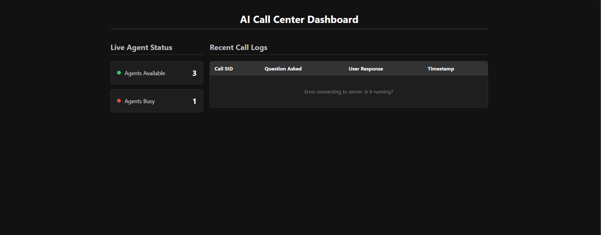

# AI-Powered Call Center Demo


This project is a working prototype of an AI-powered Interactive Voice Response (IVR) system for a call center, built with Node.js, Twilio, and a real-time web dashboard.

---

## 🎥 Demo Video


[](https://youtu.be/x5BVzP6cLpY)

---

## ✨ Features

-   **Interactive Voice Response (IVR):** Greets callers and asks a series of qualifying questions.
-   **Speech-to-Text Capture:** Captures and understands the user's spoken responses in real-time.
-   **Rule-Based Conversational Flow:** Guides the user through a predefined set of questions (name, age, reason for call).
-   **Live Call Forwarding:** Simulates routing the call to a human agent by forwarding it to a number of your choice.
-   **Real-Time Dashboard:** A web-based dashboard that displays captured call logs as they happen.
-   **API Test Simulation:** A one-click button on the dashboard to simulate a full call flow, demonstrating the backend logic and real-time UI updates without making a phone call.

## 🛠️ Tech Stack

-   **Backend:** Node.js, Express.js
-   **Cloud Communications:** Twilio (Voice API, TwiML, Phone Numbers)
-   **Frontend:** HTML5, CSS3, Vanilla JavaScript
-   **Development Tools:** `ngrok` for exposing the local server, `dotenv` for environment variables.

## ⚙️ Prerequisites

Before you begin, ensure you have the following:
-   [Node.js](https://nodejs.org/) (v14 or later) and npm
-   A free [Twilio Account](https://www.twilio.com/try-twilio)
-   A Twilio Phone Number with Voice capabilities
-   [ngrok](https://ngrok.com/download) installed and authenticated

## 🚀 Setup & Installation

Follow these steps to get your project up and running.

**1. Clone the Repository**
```bash
git clone https://github.com/your-username/ai-call-center.git
cd ai-call-center

**2. Install Dependencies**
```bash
npm install
```

**3. Set Up Environment Variables**
Create a file named `.env` in the root of your project and add your Twilio credentials. You can find these on your [Twilio Console dashboard](https://www.twilio.com/console).

```
# .env file
TWILIO_ACCOUNT_SID=ACxxxxxxxxxxxxxxxxxxxxxxxxxxxxx
TWILIO_AUTH_TOKEN=your_auth_token_here
```

**4. Configure the Call Forwarding Number**
In `server.js`, find the following line and replace the placeholder with a real phone number (e.g., your mobile) in E.164 format. This is where the call will be forwarded.
```javascript
// server.js - inside the /route-call endpoint
twiml.dial('+15551234567'); 
```

## ▶️ Running the Application

To run the demo, you need to have three terminal windows open simultaneously.

**Terminal 1: Start the Node.js Server**
```bash
node server.js
```
You should see the message: `Server running on port 3000`.

**Terminal 2: Expose Your Server with ngrok**
```bash
ngrok http 3000
```
`ngrok` will provide a public "Forwarding" URL (e.g., `https://<random-string>.ngrok.io`). **Copy the `https` URL.**

**Terminal 3: Configure the Twilio Webhook**
1.  Go to your Twilio Console -> Phone Numbers -> Active Numbers.
2.  Click on your Twilio number.
3.  Scroll down to the "Voice & Fax" section.
4.  Under "A CALL COMES IN", select "Webhook".
5.  Paste your `ngrok` URL into the text box and add `/voice` at the end (e.g., `https://<random-string>.ngrok.io/voice`).
6.  Ensure the method is `HTTP POST`.
7.  Click **Save**.

## 📞 How to Use the Demo

Your AI Call Center is now live!

1.  **View the Dashboard:** Open your `ngrok` URL in a web browser to see the dashboard.
2.  **Run the Simulation:** Click the **"Run API Test Simulation"** button. You will see the call logs appear dynamically in the table.
3.  **Make a Live Call:** Call your Twilio phone number from your mobile phone and follow the voice prompts. Your answers will appear in the dashboard in real-time.
```